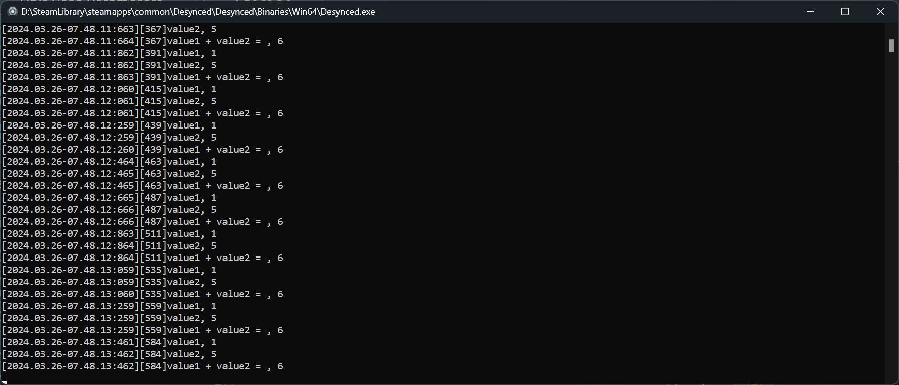

# Desynced Custom Instructions Mod Template
This is a simple mod intended to show how to create a custom Instruction for [Desynced.](https://store.steampowered.com/app/1450900/Desynced_Autonomous_Colony_Simulator/)
Instructions are a core element of gameplay in Desynced, and so being able to transcend the limitations of the built-in instructions is a sometimes necessary task to get anything done.

# Getting Started
1. [Follow the wiki's instructions](https://wiki.desyncedgame.com/Modding#Mod_Developer_Mode) to enable mod dev mode, set up the Lua Language Server for Visual Studio Code.

2. Go to the mod folder, which is in `<Your steamapps Folder>\common\Desynced\Desynced\Content\mods` and clone this repo, e.g. `git clone git@github.com:illeatmyhat/Desynced-Custom-Instruction-Mod.git`

3. Run the game and ensure the mod is loaded.

4. Check the definition of the custom instruction. It expects two constant number values. Add this instruction to a behavior and execute it. You should see the results printed in the game's logs.

# Going Forwards
The best way to learn how to use the game's Lua API is to just decompress the `main.zip` mod, which essentially contains the entire game, and read the code in `data\instructions.lua`. You can also download other mods from the steam workshop and decompress their code, too.

**Bonus:** When you decompress main.zip, the Lua LSP can jump to the relevant definitions in the game's code. Just remember to delete `def.json` to avoid trying to load the `main.zip` mod twice.

# What you should see

